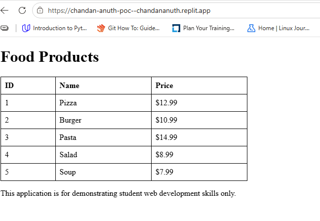

# ChandanAnuthPOC

A personal proof-of-concept project for experimenting with web development concepts, application design, and practical implementation.

## Overview

ChandanAnuthPOC is a small web application built with Node.js and Express.js.

The project provides a practical environment for experimenting with web development concepts, application structure, REST APIs, frontend and backend communication, JSON data handling, and automated testing.

The current application provides a simple food API backed by an in-memory data store.



## Project Goals

The main purpose of this project is experimentation and practical implementation.

The project explores:

* Web application development
* Client and server communication
* REST API development
* Express.js application structure
* JSON data handling
* Frontend integration
* Automated testing
* Git and GitHub workflows
* Application organization
* Practical implementation of web development concepts

The application is intentionally simple so that new features and ideas can be added and tested easily.

## Architecture

The application uses a simple client-server architecture.

```text
                         ┌───────────────────┐
                         │      Browser      │
                         │      Client       │
                         └─────────┬─────────┘
                                   │
                                   │ HTTP Request
                                   ▼
                         ┌───────────────────┐
                         │      public/      │
                         │     Frontend      │
                         └─────────┬─────────┘
                                   │
                                   │ API Request
                                   ▼
                         ┌───────────────────┐
                         │    Express.js     │
                         │     server.js     │
                         └─────────┬─────────┘
                                   │
                                   │ getAll()
                                   ▼
                         ┌───────────────────┐
                         │    database.js    │
                         │  In-Memory Data   │
                         └───────────────────┘
```

## Request Flow

A typical request follows this process:

```text
User
  │
  ▼
Frontend
  │
  │ GET /foods
  ▼
Express.js Server
  │
  ▼
database.getAll()
  │
  ▼
Food Data
  │
  ▼
JSON Response
  │
  ▼
Frontend
  │
  ▼
User
```

## Technologies

| Technology | Purpose                 |
| ---------- | ----------------------- |
| Node.js    | JavaScript runtime      |
| Express.js | Web server and REST API |
| JavaScript | Application development |
| HTML       | Frontend structure      |
| CSS        | Frontend styling        |
| Jest       | Automated testing       |
| Supertest  | HTTP and API testing    |
| Git        | Version control         |
| GitHub     | Source code repository  |

## Project Structure

```text
ChandanAnuthPOC/
│
├── public/
│   └── Frontend files
│
├── server/
│   ├── server.js
│   └── database.js
│
├── tests/
│   └── Automated tests
│
├── .gitignore
├── .replit
├── package.json
├── package-lock.json
└── README.md
```

### `public/`

Contains the frontend portion of the application.

The frontend is served by the Express.js application.

### `server/`

Contains the backend application.

#### `server.js`

The main server file is responsible for:

* Creating the Express application
* Configuring middleware
* Serving static files
* Handling API requests
* Returning JSON responses
* Starting the application server

#### `database.js`

Contains the current in-memory food data and provides access to the data through the application.

### `tests/`

Contains automated tests for the application.

The project uses Jest and Supertest to test application and API behaviour.

## API

### GET `/foods`

Returns the available food items as JSON.

#### Request

```http
GET /foods
```

#### Example Response

```json
[
  {
    "id": 1,
    "name": "Pizza",
    "price": 12.99
  },
  {
    "id": 2,
    "name": "Burger",
    "price": 10.99
  },
  {
    "id": 3,
    "name": "Pasta",
    "price": 14.99
  },
  {
    "id": 4,
    "name": "Salad",
    "price": 8.99
  },
  {
    "id": 5,
    "name": "Soup",
    "price": 7.99
  }
]
```

## Data Layer

The current proof of concept uses an in-memory data store rather than a persistent database.

The application currently contains five sample food items:

| ID | Name   | Price  |
| -- | ------ | ------ |
| 1  | Pizza  | $12.99 |
| 2  | Burger | $10.99 |
| 3  | Pasta  | $14.99 |
| 4  | Salad  | $8.99  |
| 5  | Soup   | $7.99  |

Because the data is stored in memory, it is reset whenever the application is restarted.

This approach keeps the proof of concept lightweight and makes it easy to experiment with API and application behaviour.

## Installation

Clone the repository:

```bash
git clone https://github.com/CHANDAN-AN/ChandanAnuthPOC.git
```

Move into the project directory:

```bash
cd ChandanAnuthPOC
```

Install the project dependencies:

```bash
npm install
```

## Running the Application

Start the application with:

```bash
npm start
```

The application runs on:

```text
http://localhost:3000
```

The food API is available at:

```text
http://localhost:3000/foods
```

## Testing

The project uses Jest and Supertest for automated testing.

Run the test suite with:

```bash
npm test
```

The tests are intended to verify application behaviour and API responses.

## Application Design

The application separates the main areas of functionality into frontend, backend, data, and testing.

```text
┌───────────────────────────────────────────────┐
│                 Web Application               │
├───────────────────────────────────────────────┤
│                                               │
│  Frontend                                     │
│  └── public/                                  │
│                                               │
│              │                                │
│              ▼                                │
│                                               │
│  Backend                                      │
│  └── server/server.js                         │
│                                               │
│              │                                │
│              ▼                                │
│                                               │
│  Data                                         │
│  └── server/database.js                       │
│                                               │
│              ▲                                │
│              │                                │
│  Testing                                      │
│  └── tests/                                   │
│                                               │
└───────────────────────────────────────────────┘
```

This structure keeps the different parts of the application organized and provides a foundation for future development.


## Development Ideas

The project can be expanded as additional web development concepts are explored.

Possible areas include:

* Additional REST API endpoints
* CRUD operations
* Database integration
* Frontend improvements
* Form handling
* Input validation
* Error handling
* Authentication
* Additional automated tests
* API documentation
* Deployment
* Containerization
* Cloud hosting

## Future Improvements

Potential future improvements include:

* Replace the in-memory data store with a persistent database
* Add `POST /foods`
* Add `GET /foods/:id`
* Add `PUT /foods/:id`
* Add `DELETE /foods/:id`
* Add request validation
* Improve API error handling
* Expand automated test coverage
* Improve the frontend user interface
* Add authentication and authorization
* Add environment-based configuration
* Add Docker support
* Deploy the application to a cloud platform
* Add continuous integration and deployment

## Learning and Experimentation

This project is primarily focused on practical implementation.

Rather than treating individual technologies as isolated concepts, the project provides a small environment where frontend, backend, API, data, testing, and version control can be used together.

The project can be modified and expanded as new concepts are explored.

## Project Status

**Status:** Proof of concept

The project is maintained as a personal environment for experimentation, development, and learning.